# My Car - *The car talk app*

[View code here](https://github.com/belovedpearl/mycar_frontend)

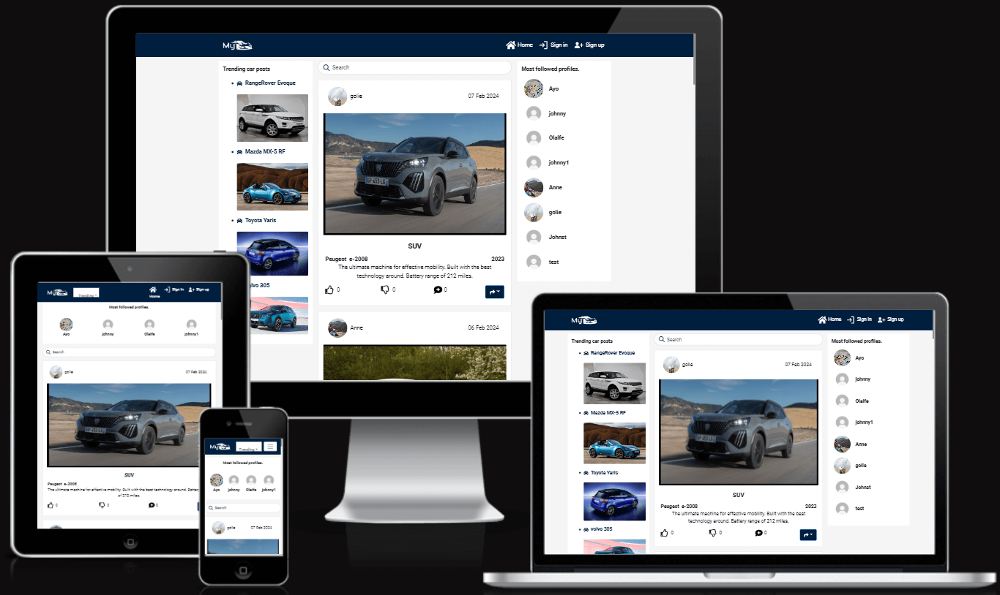

[View site responsiveness here](https://ui.dev/amiresponsive?url=https://mycarfrontend-7c56357f5f33.herokuapp.com/)

---

**Table of Contents:**

---
---
 * [Scope](#scope)  
 * [Background](#background)
 * [Target Audience](#target-audience)
 * [Wireframes](#wireframes)
    * [Wireframe 1](#wireframes-1-the-landing-page)
    * [Wireframe 2](#wireframe-2-the-post-details-page)
    * [Wireframe 2](#wireframe-3-the-profile-page)
* [User Stories](#users-story)
    * [Navigation and Authentication](#navigation-and-authentication)
    * [Posts](#posts)
    * [Reviews](#reviews)
    * [Upvote and Downvote Posts](#upvote-and-downvote-posts)
    * [Profile page](#profile-page)
* [Features](#features)
    * [General Project Structure](#general-project-structure)
    * [Navigation](#navigation)
    * [Authentication](#authentication)
    * [Homepage/Landing Page](#homepagelanding-page)
    * [Reusable Components](#reusable-components)
* [Bugs](#bugs)
* [Design Choices](#design-choices)
* [Future Features](#future-features)
* [Technologies Used](#technologies-used)
    * [Languages](#languages)
    * [Frameworks and web Applications](#frameworks-and-web-applications)
* [Development and Deployment](#development-and-deployment)
     * [Development Workspace Setup](#development-workspace-setup)
     * [Deployment](#deployment)
     * [How to connect React frontend to Backend](#how-to-connect-react-frontend-to-the-backend-api)
     * [How to use React Bootstrap](#how-to-use-react-bootstrap)
* [How to fork](#how-to-fork)
* [How to Clone](#how-to-clone)
* [Testing](#testing)
     * [Automated Testing](#automated-testing)
     * [Manual testing](#manual-test)
     * [Validator testing](#validator-test)

* [Credits](#credits)
* [Acknowledgement](#acknowledgement)
     

---
# Scope

This the readme for the mycar project's frontend. To know more about the backend, please visit this [link](https://github.com/belovedpearl/mycar_drfapi).

MyCar is a specialized social networking platform tailored for car enthusiasts. It's name was derived from its core objective: fostering discussions and serving as a comprehensive guide for individuals passionate about automobiles. Through MyCar, users can engage in vibrant conversations, share their experiences with specific cars, and access valuable insights to enhance their automotive journey.

The interactive platform of MyCar empowers users to initiate discussions by adding their own posts, inviting others to contribute their reviews and insights on specific car topics. Through the platform, users can engage in dynamic conversations, expressing their opinions by upvoting or downvoting posts to stimulate dialogue about various car topics. Additionally, users have the ability to connect and establish friendships by following other users, further enhancing the collaborative environment of the platform.

The platform renders differently depending on the authentication state of the user. Non-authenticated users can view all posts, posts details, perform search and filter registered users posts, upvotes and downvotes. They are also able to register using the signup link on the navbar. In addition, Authenticated users can add post, add reviews, upvote and downvote posts. They can also follow another user and also unfollow them.
 
[View the live project here](https://mycarfrontend-7c56357f5f33.herokuapp.com/).

---

# Background

---

This project is inspired by the Code Institute's 'Moment' walkthrough project. As a passionate car owner, I've often considered the idea of a dedicated community for fellow car enthusiasts. A place where individuals can share their experiences, insights, and opinions about the cars they own or have driven. This community would serve as a valuable resource, providing a wealth of knowledge and guidance for those considering the same car or seeking advice on its usage and maintenance.

For novice car owners especially, having access to a pool of information about their vehicle can be invaluable. From understanding the details of its operation to estimating maintenance costs and uncovering tips for optimal performance, there's a wealth of information waiting to be shared.

This project aims to be the ultimate hub for car enthusiasts, offering a platform where users can explore, learn, and engage with others who share their passion for automobiles. Whether it's discussing the latest models, sharing driving experiences, or delving into the finer details of car mechanics, this community strives to be the go-to destination for all things automotive.

---
# Target Audience

---

This project is tailored for a car the following set of people;

* Car Enthusiasts who seek to connect with people of like minds.
* New car owners seeking for guidance, tips, and advice on their car.
* Aspiring Car Owners seeking insights from real users.
* Automotive Professionals use the platform to stay updated on industry trends, share technical knowledge, and engage with enthusiasts to understand consumer preferences and feedback.
* Auto Bloggers, Journalists and Content creators specializing in automotive topics.

---

# Wireframes

---

While conceiving the project the following were the wireframes were used to represent the home, profile and details page.

All wireframes are made with Balsamiq.

[Link for the wireframe pictures can be found here](screenshots/wireframes)

# Wireframes 1: The Landing Page

### Desktop and Laptop

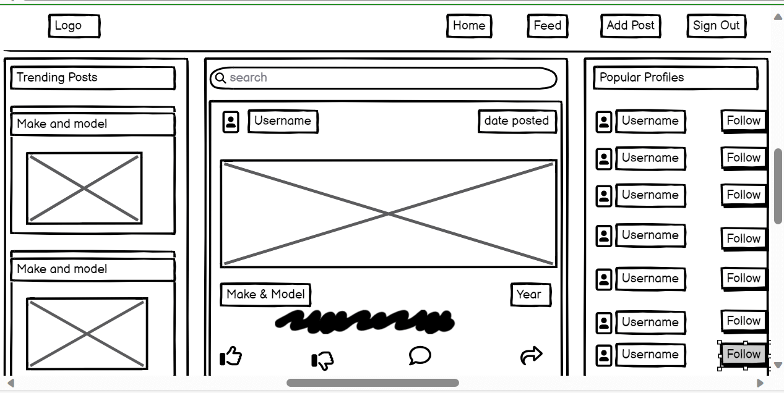

### Mobile

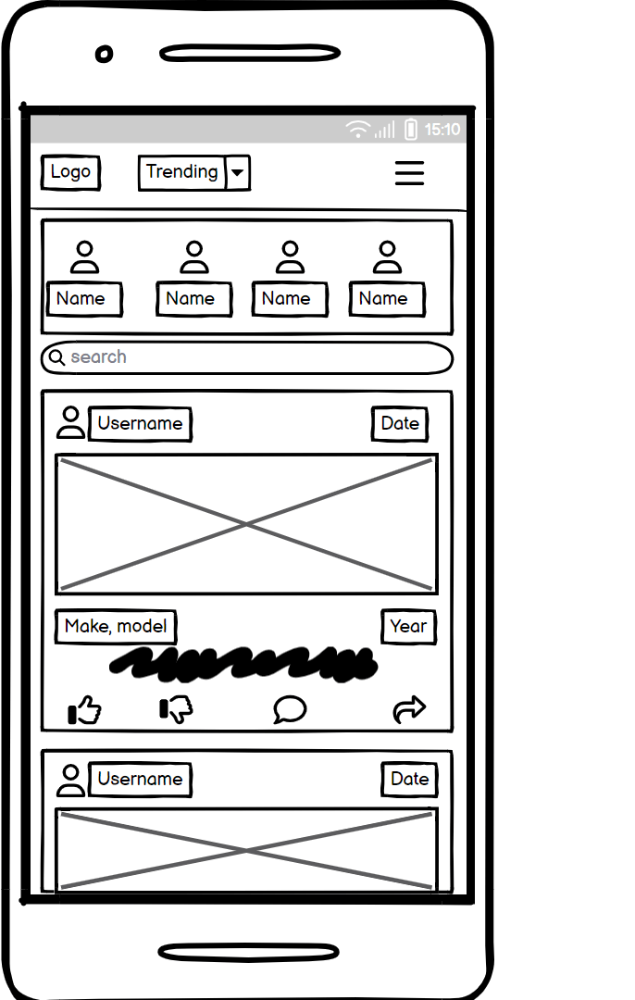

---

# Wireframe 2: The Post Details Page

### Desktop and Laptop

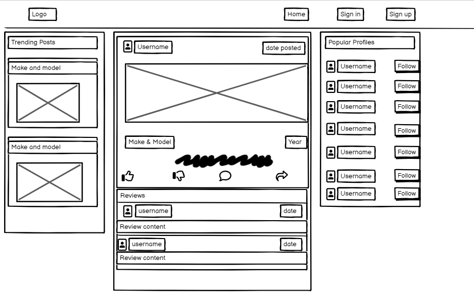

### Mobile

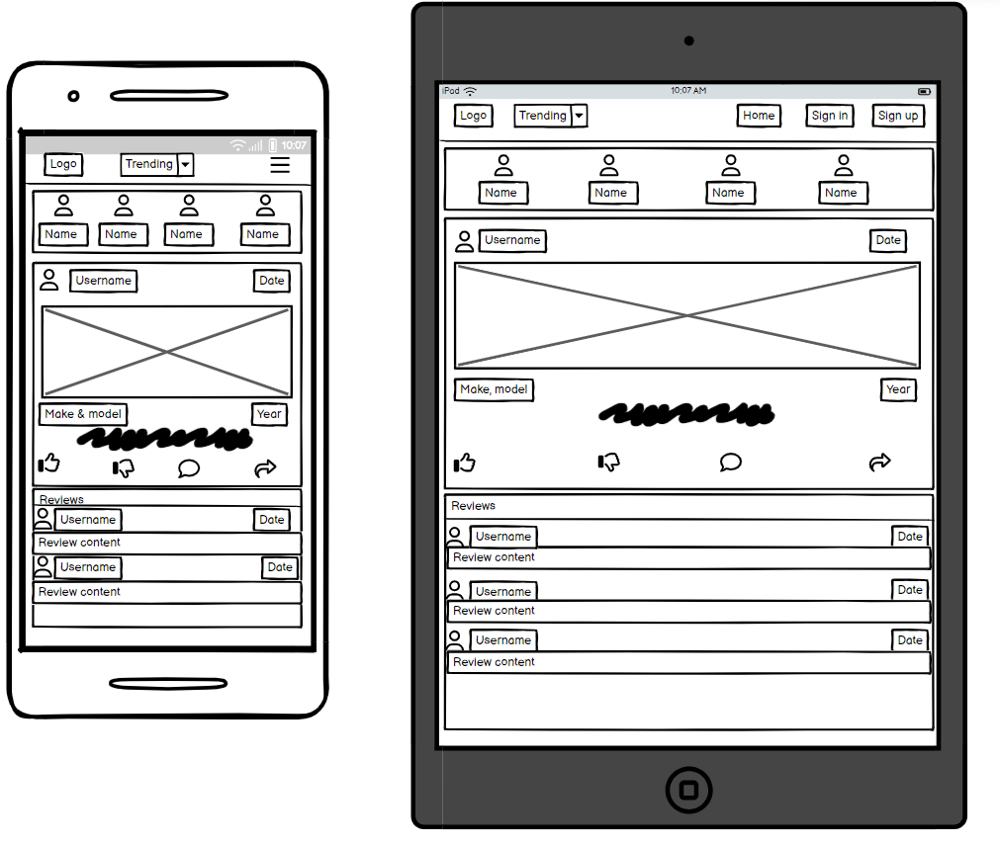

---

# Wireframe 3: The Profile Page

### Desktop and Laptop

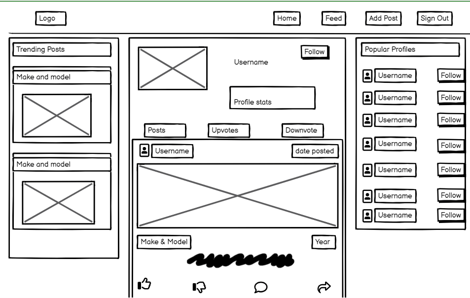

### Mobile

Details of other wireframes drawn for the development

    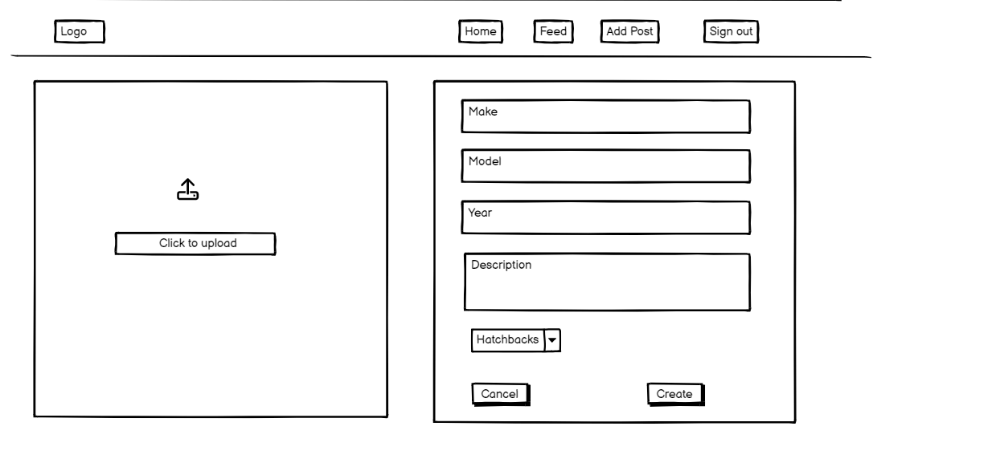
    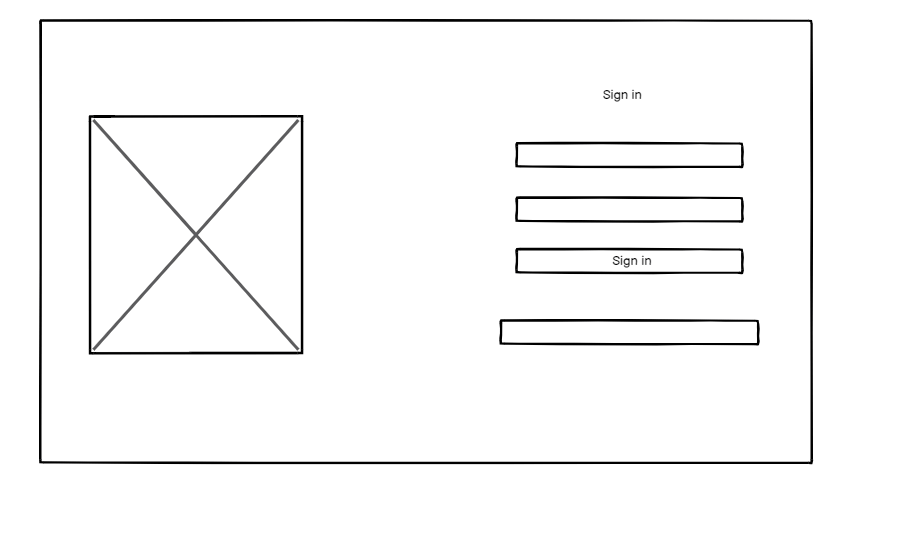
    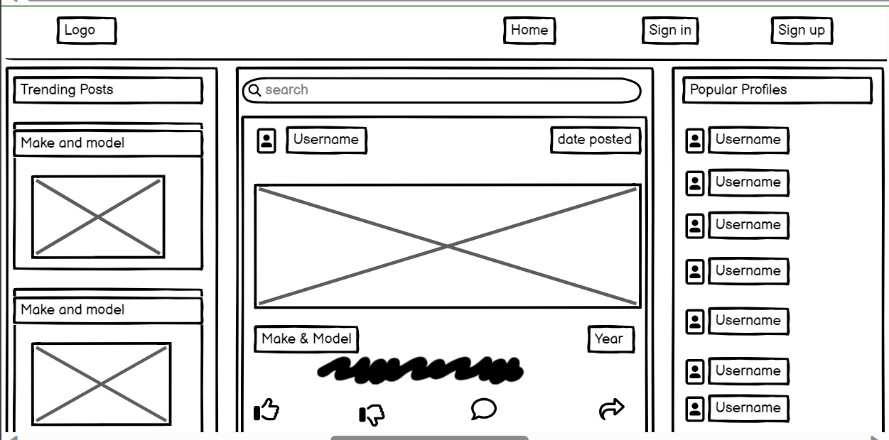
    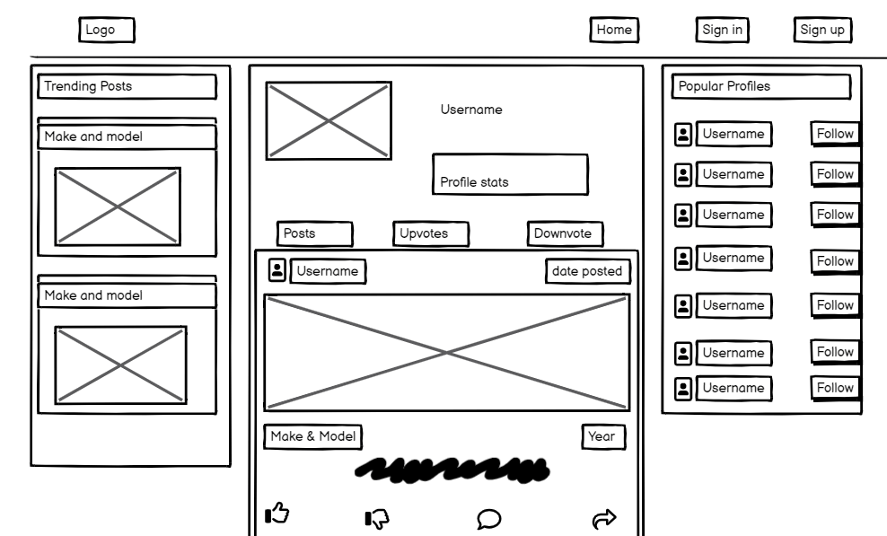
    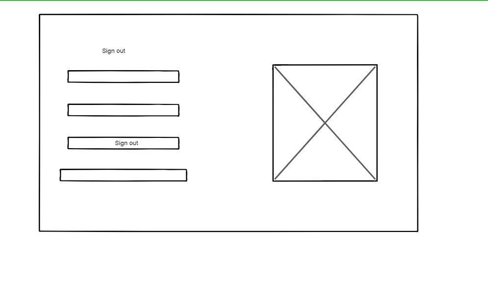
    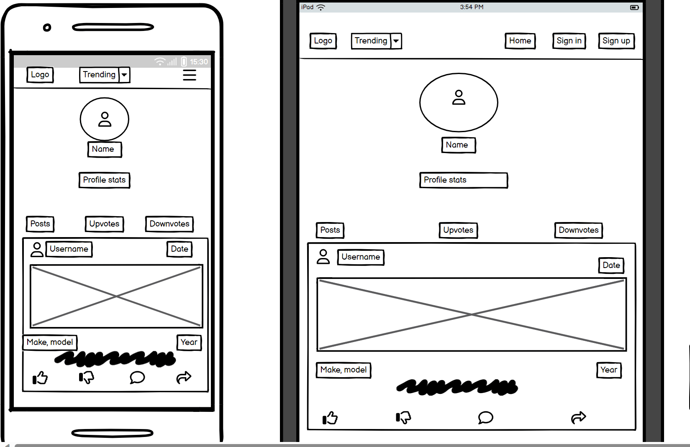
    
    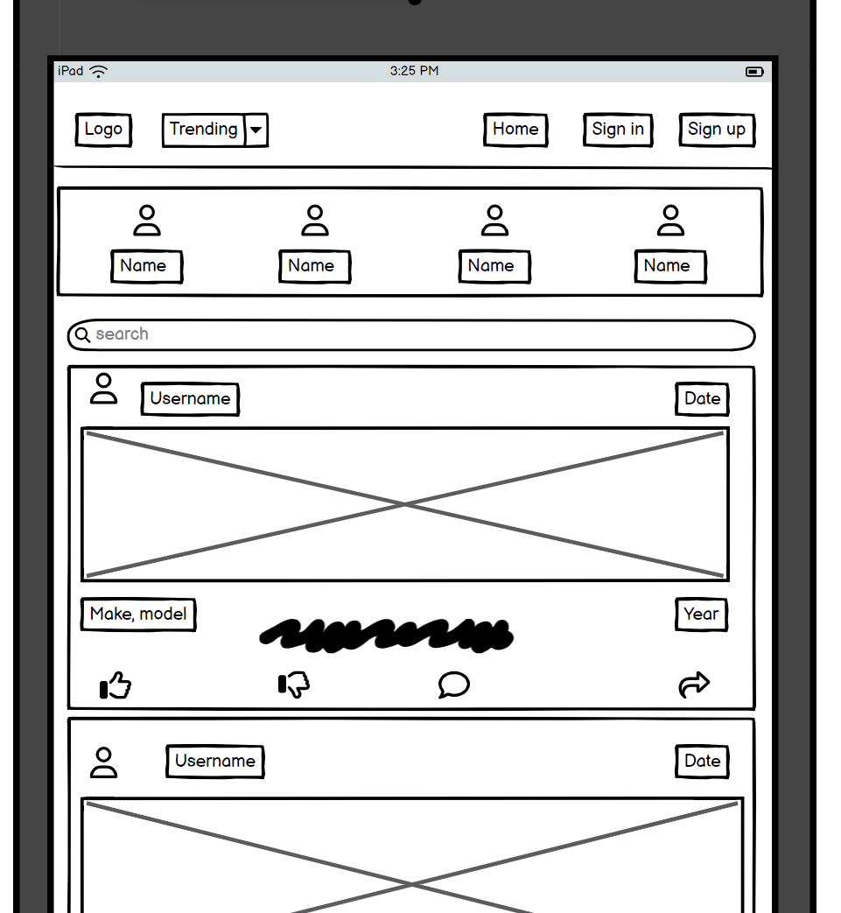

---
# User's Story

The project was managed using github [project board](https://github.com/users/belovedpearl/projects/9/views/1);

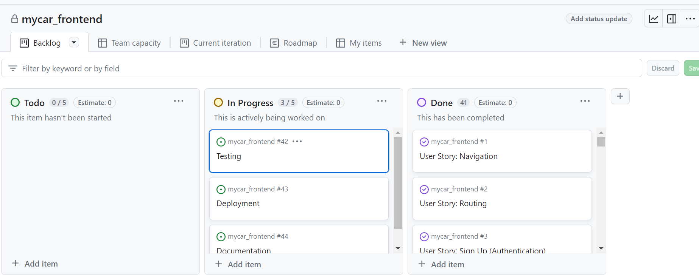

Sections of development was coordinated using different milestones to aid proper actualization of the targets. Project milestones setup is found [here](https://github.com/belovedpearl/mycar_frontend/milestones)

## Navigation and Authentication

* As a User, I can view a uniform navbar on every page so that I can understand and navigate easily between the app's pages.

* As a User, I can navigate through pages so that I can view content seemlessly without page refresh.

* As a User, I can register to create a new account so that I can access all features for signed up users.

* As a User, I can sign in to the app so that I can the full features of the app.

* As a User, I can see that I am signed in so that I can know when to sign in

* As a User, I can maintain my signed in status until I choose to logout so that I can fully enjoy my time on the app

* As a Signed out user, I can the sign in/out options so that I can decide what to do from there.

* As a User, I can see the user's display picture so that I can identify the users of the application.

## Posts

* As a User, I can add post to the platform so that I can share my posts for other users to share their views and opinions

* As a User, I can view the details of a single post so that I can access more information about the post.

* As a User, I can view posts in descending order of creation so that I can be up to date with new posts from other users.

* As a User, I can continue to scroll through posts on the application so that I can continue to see contents without having to use the next button

* As a Logged in user, I can view posts from users I follow so that I can know about the latest content from the people I follow.

* As a User, I can see time the post was created so that I can know how long it was the post has been made.

* As a User, I can view the details of a single post so that I can access more information about the post.

* As a Logged in user, I can update my posts so that I can make corrections after creating it.

* As a logged in user, I can delete my posts so that I can remove my contents from the application.

## Reviews

* As a logged in user, I can add reviews so that I can contribute my knowledge about the specific car to the platform.

* As a user, I can see the display picture and name of the review author so that I can know who made the contribution.

* As a user, I can see when the review was posted so that I can know how old the review is.

* As a User, I can delete reviews I created so that I can remove my reviews from the post and the application.

* As a logged in user, I can update my review on my post so that I can correct wrong information on the review. 

## Upvote and Downvote Posts

* As a Logged in user, I can either upvote a post or downvote it so that I can communicate my prefrences accurately to the platform users.

* As a user, I can see upvote or downvote counts next to the upvote\downvote icon on the posts page.

* As a User, I can view upvoted posts by a user so that I can discover and appreciate the content preferences and interests of that user 

* As a logged in user, I can view posts downvoted by a user so that I can gain more insight into an individual's automotive tastes and preferences.

## Profile Page

* As a User, I can access a user's profile so that I can see the details about the users of the application.

* As a User, I can see the user's display picture so that I can identify the users of the application.

* As a User, I can see posts made by the user so that I can view their contributuions to the platform.

* As a Logged in user, I can update my profile information so that I can add more details about myself.

* As a Logged in user, I can update my username and password so that I can enhance the security of my account and personalize my online identity.

* As a User, I can view a list of most followed profile so that I can discover popular users and probably connect with like-minded individuals enhancing my overall exprience of the platform.

* As a Logged in user, I can follow a user I admire so that I can be updated by their posts.

* As a Logged in user, I can unfollow a user I follow so that I can change my mind and stop getting their updates.

---
# Features

---

This section discusses the features and pages of the project 'My Car', the design choices made, discussion of the components use that make up the different pages seen by users.

### General Project Structure

My Car renders in two different ways depending on user authentication; 'logged in or logged out'. User's state determines changes navbar content and restriction of actions that can be accessed by the user.
 

### Navigation

The Navigation bar (NavBar) is used to navigate through the app. It renders based on the state of the user (logged in / logged out).

Navbar also differs based on the device used to access the site;

* On a large screen

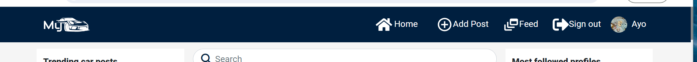

* On tablets and mobile devices

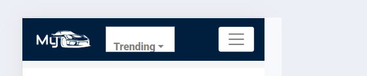

For a logged out user, the NavBar renders the following icon;

* MyCar Logo - This is visible throughout the site and links back to the homepage.

* Home - This is a Nav link item that links to the home page when clicked.

* Sign In: This is a Nav link item that links to the sign in form for already existing users.

* Sign Up: New users are able to use this link to access the sign up form in order to create their account.

For a logged in user, the Nav Bar renders the following links in addition to the logo and Home links described above;
.
* Add Post: This link allow signed in users to access the add post form to create a post they want to add to the platform.

* Feed: This link allows users to see posts from profiles they are following arranged in the descending order of creation.

* Sign Out: This link allows signed in users terminate their session.

* Current User Profile Name and Picture: This shows the currently signed in user and also links up to the user's profile

## Authentication

New users can create an account by clicking on the 'Sign Up' link on the Navigation Bar to create a user account. 

A sign up form is displayed, processed using the standard dj-rest/auth/registration. Once successful, a user profile is automatically setup and the user is able to access the full functions of a registered user.

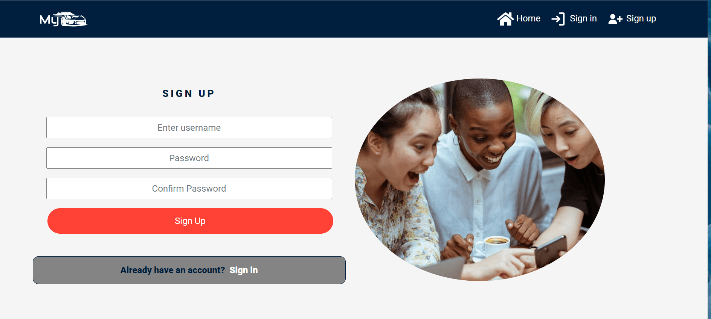

Details of sign up form for small screens

    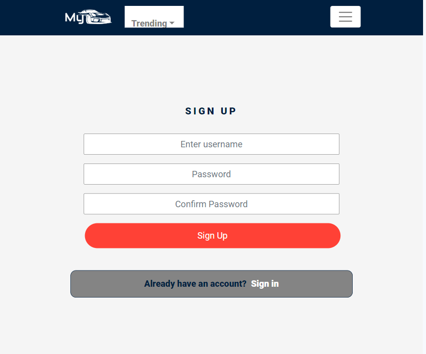
    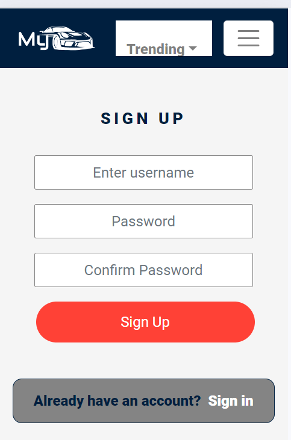

For an already existing user to access their account, a click on the Sign In menu option opens up the sign in form to complete to sign into their account.

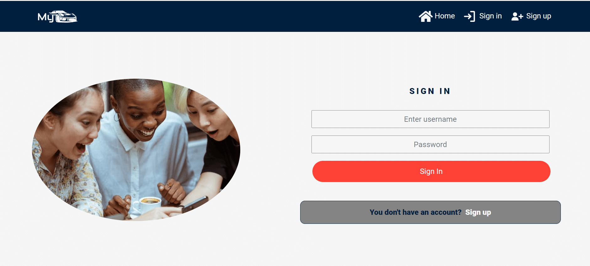

Details of sign in form for small screens

    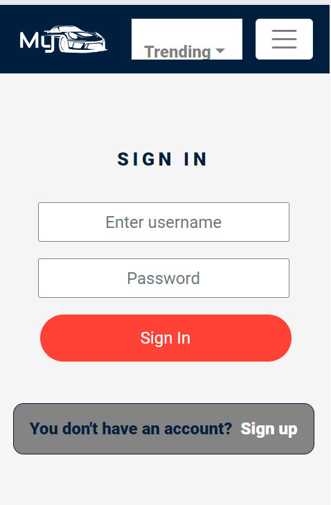
    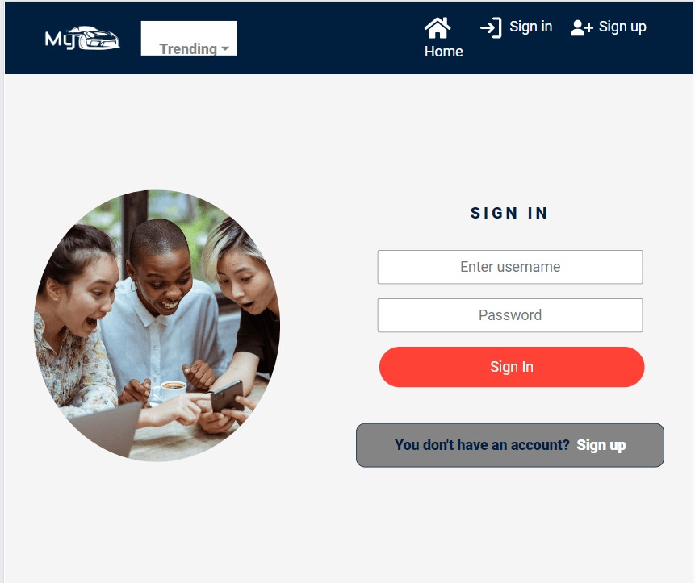

To promote accessibility, the authentication forms are linked to the other;

The sign in form has a link to the sign up page for unauthenticated users trying to use the sign in form.

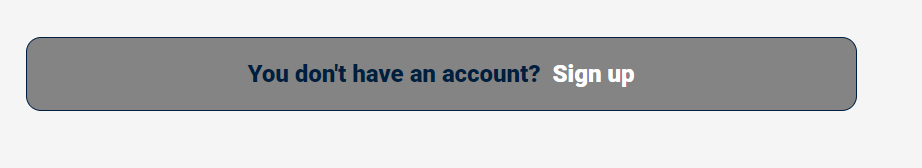

The sign up form has a link to the sign in page for authenticated users to useto access their account.

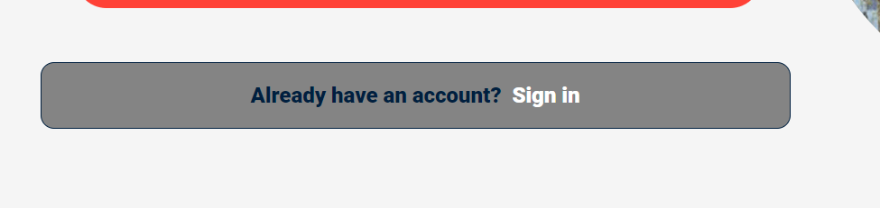

---

## Homepage/Landing Page

The homepage consists of the following;

* Posts
* Popular Profile component
* Trending posts component
* Search feature

### Post

All created posts on the platform are displayed on the homepage once successful. Posts created are displayed in the descending order of creation. On each post displayed, users can see the following;

* Post author name and picture
* Time of post creation.
* Number of upvotes on the post
* Number of downvotes on the post
* Number of reviews on the post
* Author's description of the post

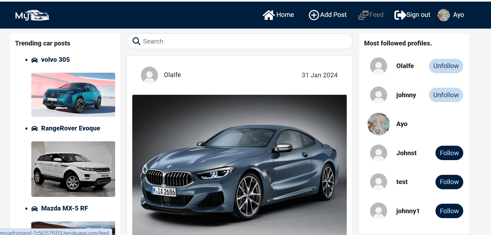

### Popular Profile Component

The popular profiles component features to display profiles ordered based on the number of followers from highest to lowest.

On large screens, this component displays on the right side of the post list and can feature up to ten profiles.

On small screens, popular profile component displays above the search feature on smaller screens and features four profiles.

From this component, signed in users can follow another user clicking the 'Follow' button. For a signed out user/unauthenticated user, the follow button is not visible.

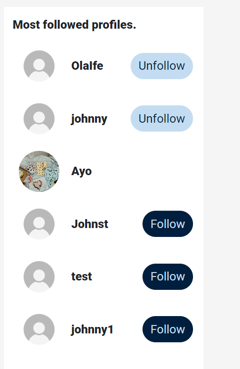

If a user is following the profile user, the button shows 'unfollow' allowing the user to also unfollow a user from the profile component.

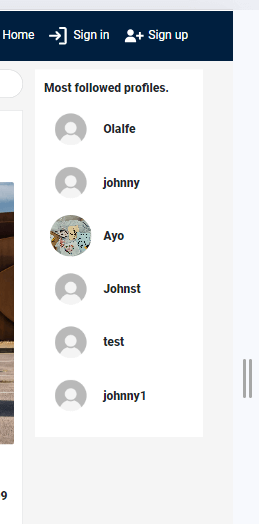

An unauthenticated user is only able to see the profile display picture and name. They can also click on the profile picture to access the user's profile.

### Trending Posts Components

The trending posts component features to display posts ordered based on the number of upvotes from highest to lowest. A post with higher number of downvotes to the upvotes is not included in the trending posts list. It is available for view and use by all users.

Each post is accessible by clicking on the list which then opens up the full posts detail.

On large screen, it displays on the left side of the posts list.

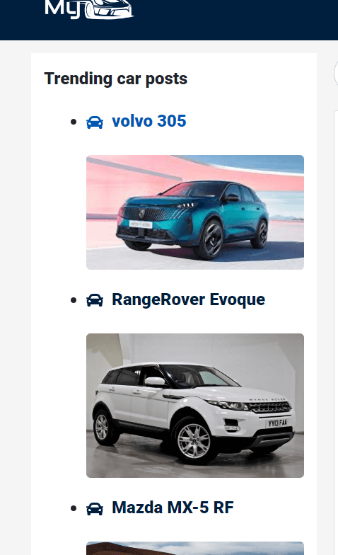

On small screens, it resolves to a dropdown featured on the Navbar from where the user can view the list of posts.

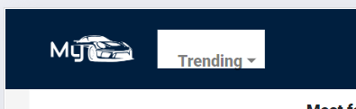

---

### Search Feature

Users are able to search for different interest using the search bar on the homepage. To improve user experience and allow for a more enjoyable search experience, users search have been customized to search by;

* Year
* Model
* Make
* Post Author
* Body types

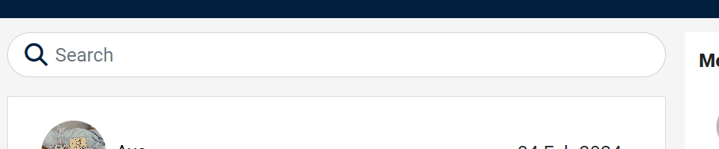

---

### Feed

Feed filters posts by profiles the user is following. It can be accessed with the link 'Feed' on the navigation bar of a signed in user. A not found page is displayed if the user is not following any user.

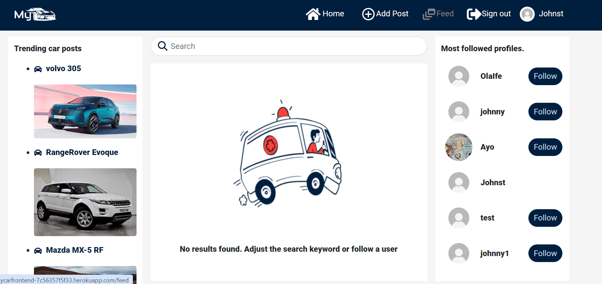

---

### Post Page

Post page displays all a post including the reviews. The page is accessed by a click on the post image from the home page/ feed page, it can also be accessed from the review icon on a post.

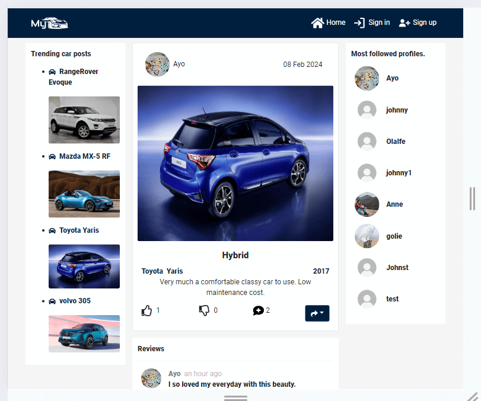

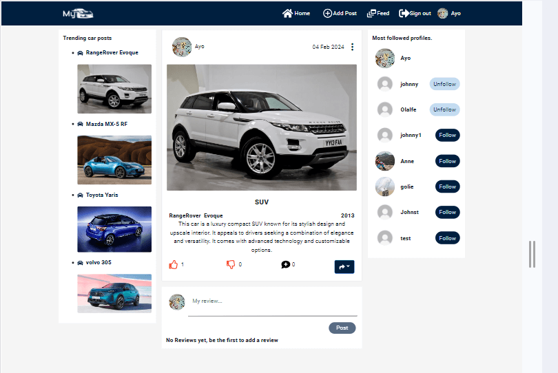

Post owners are allowed access to a dropdown from where they can edit and delete the post using the edit and delete icons. Non-post owners cannot perform update or delete functions on any post.

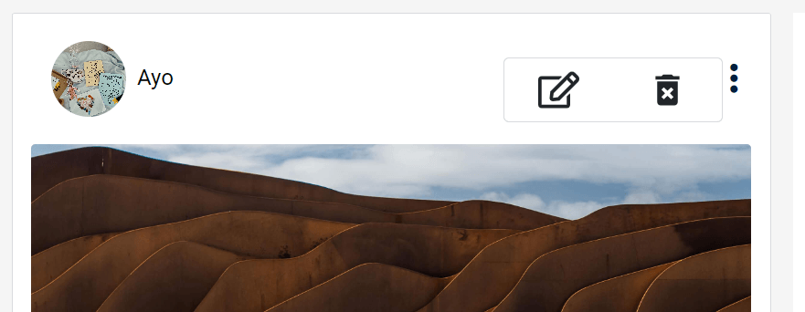

Selecting the edit icons opens up the PostEditForm containing the already defined fields and user can add more information or change contents of his already created post. On successful post edit, users are redirected to the postpage where users can see the changes in the post detail he created.

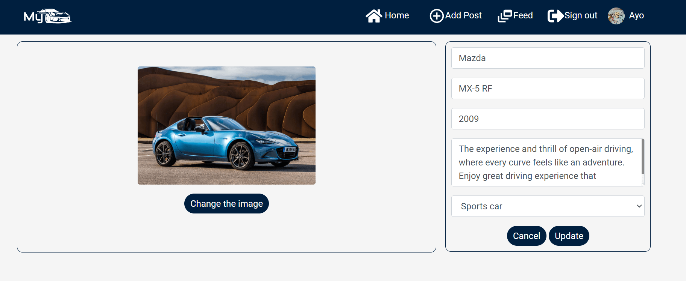

Edit post form small screens

    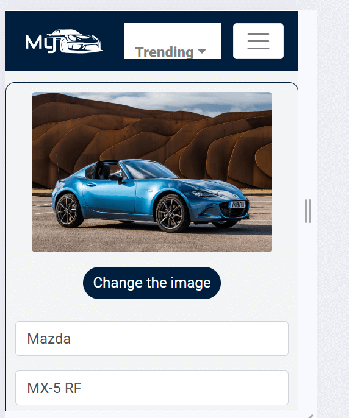

Selecting the delete icon will remove the post from the API and the user is redirected back home where the post is no longer visible.
From this page, users are able to use the share button, see upvotes and downvotes count on the post and also the count of the reviews.

### Reviews

Just below the post detail is the reviews section where authenticated users are allowed to add reviews about a car post.

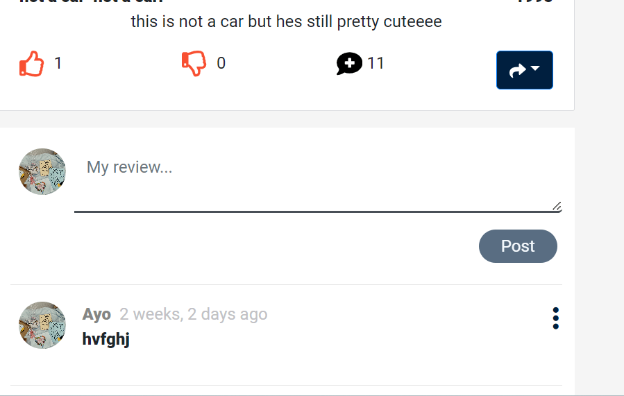

If there are no reviews, users see the message informing them of no review and prompting them to add one.

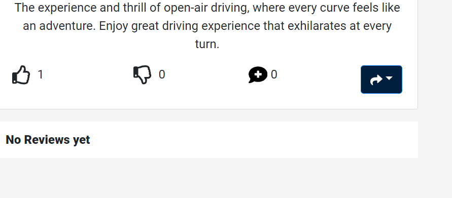

Review owners have access to edit and delete their reviews using the dropdown menu that pops up when the three dots is clicked.

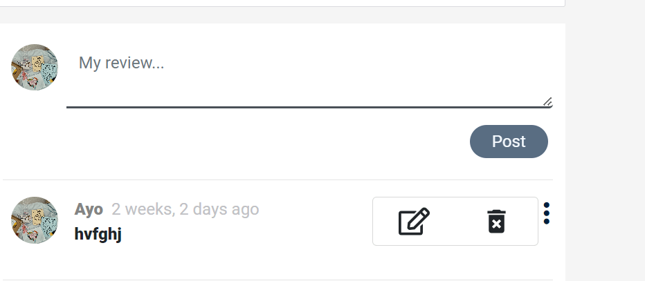

Unauthenticated users can only view already existing reviews and cannot perform any actions on it.

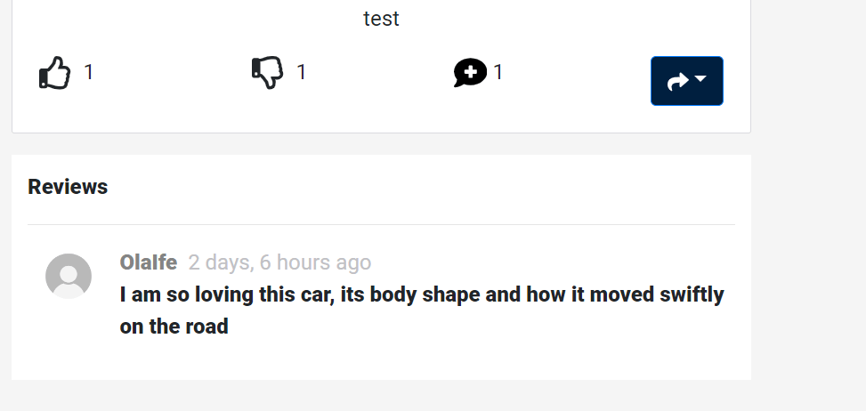

### Share Post

I have added a share function to the website to allow users share contents of each posts across different medias like twitter, facebook, pinterest and mail.  All users can share posts from this platform, this is to further promote the awareness for this site. 

Using the [react share](https://www.npmjs.com/package/react-share) documentation on react, [this video](https://youtu.be/XViKPMwEZFU?si=VjywkKN-rYOY09Cx) and a bootstrap dropdown, I was able to include a share post feature on the platforms mentioned. Posts can be shared from the homepage and from the post detail page.

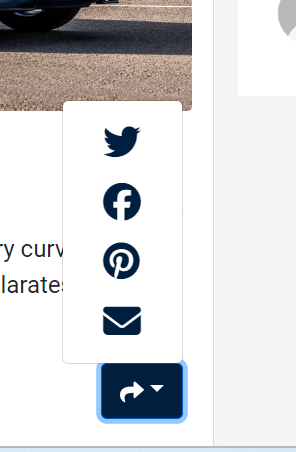

### Upvote and Downvote

Authenticated users are able to add an upvote and downvote to post by clicking on the thumbs up and thumbs down icon respectively. The website is designed in a way that users that have created an upvote for a post cannot also create a downvote for the same vote to prevent double votes from the same user. Also double clicking the icon will remove the already created vote.
Authors of posts are not allowed to upvote or downvote their posts.

### Profile Page

The profile page holds the profile information about a user, it can be accessed by clicking on the profile picture of the user throughout the website.

Information displayed by the profile page include the following;

 * Profile picture: If not available, a default picture is used which can be later updated if desired.
 * Username
 * Profile Stats which includes the number of posts created, number of profiles the user is following(followed) and the number of profiles following the user (following).
 * Posts created
 * Posts Upvoted
 * Posts Downvoted

The profile page conditionally renders the following profile information if available;

* Job title
* Current employer
* Location
* About

A new profile is automatically created when a new user signs up to the platform.

To edit their profile information, users can use the three dots menu to access and update information about their profile.

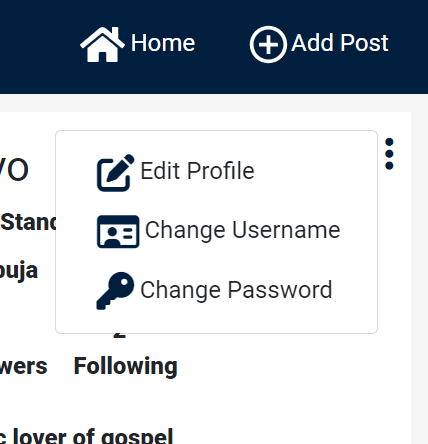

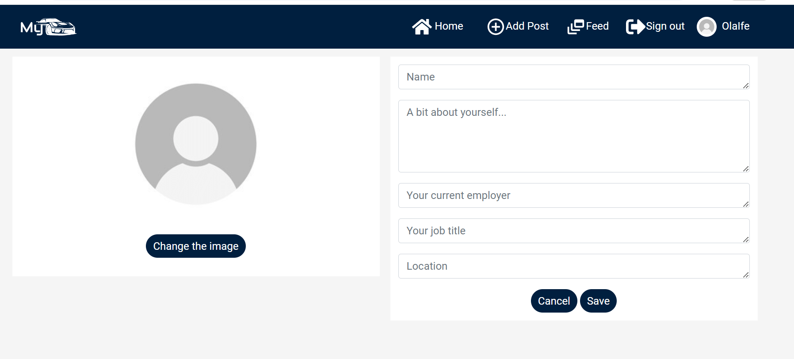

From the profile page, each user can change their username and password by accessing the 'change username and change password form' clicking the menu icons desired.

Change password and username form

    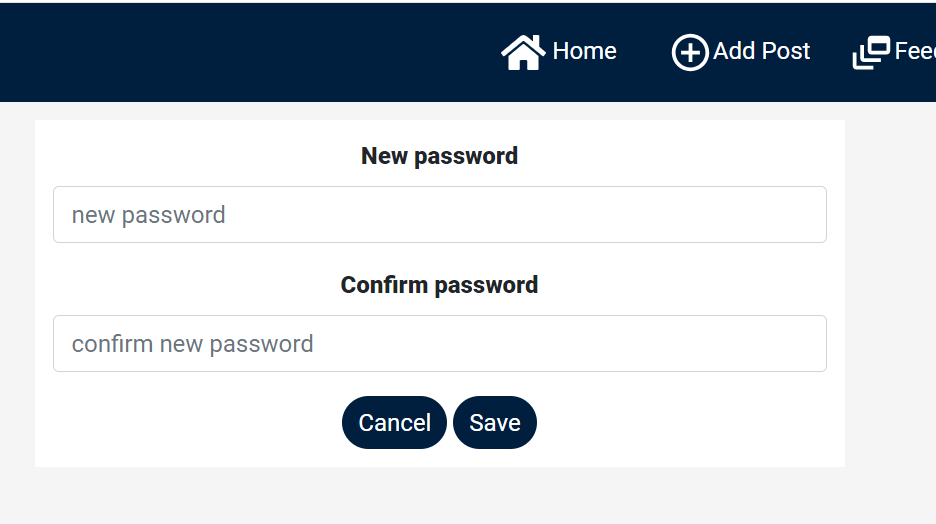
    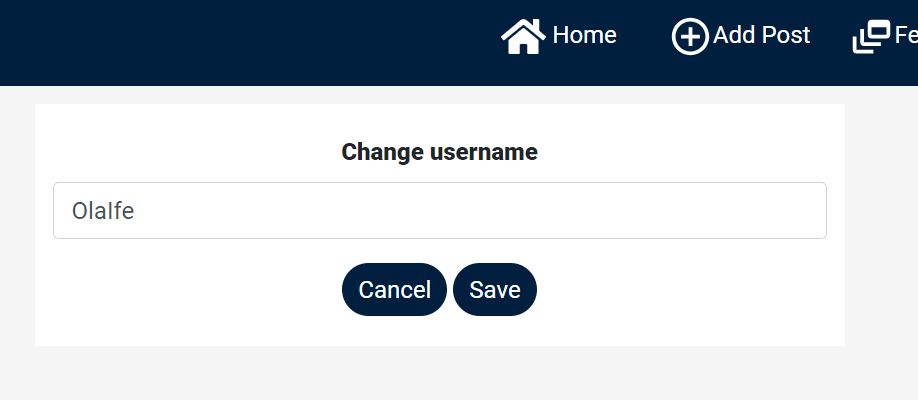

### Follow and Unfollow

Follow function is linked to each profile which acts as a way to foster relationships on the platform. User can click the follow button to follow other profiles. Users are not allowed to follow their own profile.

With each follow created by a user, the number of his following stats increases by 1. If the user is followed by other user, his followed stats increases by the total number of followers.

Follow button is visible on the Popular profile components of an authenticated user and on the profile page

Follow button on popular profile and profile page

    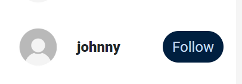
    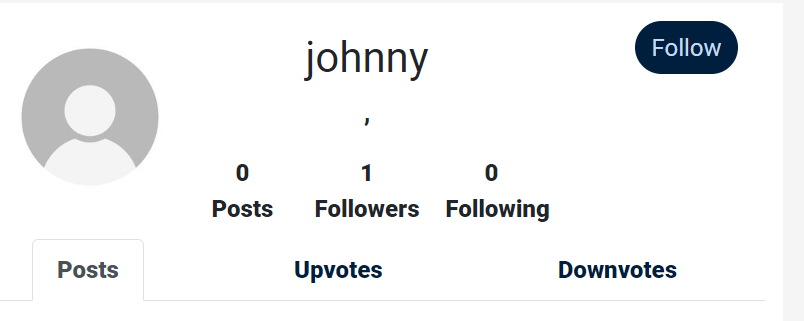

Once a follow is established between two profiles, the follow button changes to unfollow allowing the user to change his mind about following a user. Once clicked, the followers stats of the profile reduces.

Unfollow button on popular profile component and profile page

    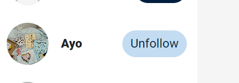
    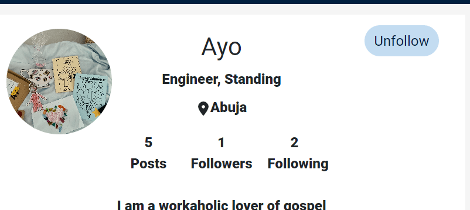

## Reusable Components

Asset:  Used to load images, messages and loading spinners across the website.
Avatar Used to display avatars across the website.
NavBar: Used across the website for uniform view to users.
Not Found Page: Page displayed when users provides an invalid url. It has a button that returns the user back home.
Three Dots: Used to access dropdown menu for further actions.
MoreToDo: Used to allow users access the edit and delete functions
Share: Reused on all posts to share contents across other platforms.

Reusable components used

    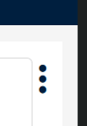
    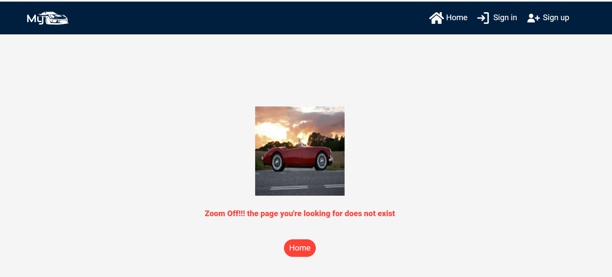
    
    

---

# Bugs

* Access to XMLHttpRequest at 'https://mycardrfapi-d64556077ed4.herokuapp.com/dj-rest-auth/registration/' from origin 'https://3000-belovedpear-mycarfronte-xe7q5mhm7wg.ws-eu107.gitpod.io' has been blocked by CORS policy: Response to preflight request doesn't pass access control check: No 'Access-Control-Allow-Origin' header is present on the requested resource.

       Removing the cookie blocker on my system fixed this. 

* Sigin link not displaying - style on the font icon made it not visible

       Adjusting the icon dolor fixed this.
      
* Post edit not retaining image

       Replacing the 'Put method' in the request with a 'Patch' fixed this.

* Classname styles not applying many times.

       Replacing the '' with a {} fixed many of the classes bugs I had.

* webpackHotDevClient.js:138 src/pages/posts/TrendingCarPosts.js
  Line 24:8:  React Hook useEffect has a missing dependency: 'trendingCarPosts'. Either include it or remove the dependency array  react-hooks/exhaustive-deps
      
       I removed the dependency array but I got an infinite loop, I read more about the dependency array and found out that I can ignore the warning 

* Share post feature not sharing the specific post content but the page its clicked on.

        Refactoring my code to share the specific post id fixed this.

---

# Design Choices

The design choices made in the project includes;

## Font

I have chosen to use Roboto font for this project as it is clean, bold, and has a nice presentation. It has a fallback of Sans-serif.

## Colour Scheme

I have chosen to use shades of blue and some touch of red where required across the website.

Body Background Color: A shade of white (#f5f5f5) was used throughout the website;

Navigation Bar, upvote icons, downvote icons, review icon and count, follow button, post font color, All have a shade of blue (#001F3F).

In order to boldly project the upvote and downvote icons when clicked/ hovered, I used the red color shade #f85032 which is bright and eye catching.

Each posts features on a white (#ffffff) background to properly distinguish between the background and the post.

Different color combination used and their contrast ratio is summarized below:

---
.
# Future Features

* Improve user search experience by adding a title field consisting of 'make and model'.

* Allow users to report posts that do not adhere to the aims of the site.

* Develop admin frontend functionality to moderate contents posted on the website

* Explore react share library to implement the share function and also implement share count.

* Allow users add more than one image.

* Allow users report post and users to limit unwanted posts and hold users accountable for using the application

---

# Technologies Used
---

## Languages

* HTML5 - Provides the content and structure for the website

* CSS3 - Provides the styling for the website

* JavaScript - Used for interactivity of elements on the website

* React.js - Provides the base for the frontend components

## Frameworks and Web Applications

* [React Bootstrap](https://react-bootstrap-v4.netlify.app) - A css framework by bootstrap to be used by react projects.

* [Github](https://github.com) - Used to host the repository, store codes and commit history and also manage the project board.

* [Balsamiq](https://balsamiq.cloud) - Used to create the wireframes

* [Coolors](https://coolors.co/) - Used to pick the colour scheme of the website

* [Favicon](https://favicon.io) - Used to create the favicon

* [Heroku](https://heroku.com) - A cloud platform hosts the deployed application.

* [Google Fonts](https://fonts.google.com) - Used as a source to import the website font

* [Lighthouse](https://chromewebstore.google.com/detail/lighthouse/blipmdconlkpinefehnmjammfjpmpbjk?pli=1) - Used to test site performance

* [Google Chrome DevTools](https://developer.chrome.com/docs/devtools/) - Used to debug and test responsiveness

* [Cloudinary](https://cloudinary.com) - Used to hosts image files in the project.

* [Design AI](https://designs.ai) - Used to generate the illustrations used across the website

* [W3C Validation](https://validator.w3.org/) - Used to validate HTML code

* [W3 css Validation](https://jigsaw.w3.org/css-validator/) - Used to validate CSS code

* [JSHint Validation](https://jshint.com) - Used to validate JavaScript code

* [Pexels](https://pexels.com) - Free stock image provider for posts and avatars that were uploaded

* [Vecteezy](https://www.vecteezy.com) - Used to source free vectors for default avatars.

* [Font Awesome](https://fontawesome.com) - Used for some of the icons.

* [React Icons](https://react-icons.github.io/)

* [Squoosh](https://squoosh.app/) - Used to convert someimage to webp

* [Tiny png](https://tinypng.com/) - Used to compress images used

---
# Development and Deployment

## Development Workspace Setup

* Create a new workspace using this [code institute specific template](https://github.com/new?template_name=react-ci-template&template_owner=Code-Institute-Org).

* Give your application a name

* Click on the **create repository** button  to create a new repository for the project.
      * Make sure the repository name is written in lowercase.

* Click on the gitpod button to create an empty workspace.

* Enter the command, 'npm install'. Allow all packages to be installed.

* After installing all packages, enter the command 'npm start'. This should open up the react default page.

To prepare for a first deployment, remove the custom header in the App.js and Replace it with your desired content. Also, remember to remove unwanted imports.
Add, Commit and Push to Github.

## Deployment

After creating a new gitpod workspace and set up for the new project, you can make the first deployment to Heroku.

* On your dashboard, select 'Create New App'
* Give the a unique name related to your project (heroku requires that all apps have a unique name).
* Select a region that corresponds to where you are
* Click 'Create App'.

Back into the **Deploy** tab select GitHub as the **deployment method**
* Locate your project repository and click **Connect**.
* Click **Deploy branch** to start the application buildup process.

After a successful deployment, the message **build successful** is displayed. You can click the button **Open app** to view the application in the browser.

---

## How to connect React frontend to the Backend API

After setiing up and deployment successful to heroku, connect the frontend (workspace version and deployed version) and the backend API for effective communication between the two parts of the application.

* On heroku dashboard, select the API application.
* Click on the settings tab.
* Scroll down and click on the *reveal config vars** vutton.
*  Select **Add a new config var**
* In the input displayed, add a new config var 'CLIENT_ORIGIN', set up up the value to the **URL** of your **deployed application**.
* Add another config var 'CLIENT_ORIGIN_DEV', set up the value to the **URL** of your **gitpod workspace**

**NOTE:**

      - For effective connection, remember to remove the trailing slash at the  end of the urls.
      - Gitpod occasionally change its url, you can update the url if changed.
      - Install the Axios library using the command 'npm install axios'.

* In your frontend workspace, create a folder called 'API' and inside it create a file called 'axiosDefaults'.

* import axios at the top of the file

* Define your baseURL which is the unique URL of the deployed API project.

* Set the content-type header to multi-part/form-data, this is required because the project deals with images as well as text in it's requests.

* In order to avoid any CORS issues, set withCredentials to True.

* Import this file into App.js to be used across all pages

To aid the development, you will need to:

* Install the following:
    JSONView
    ES7 React|React|GraphQL|React-Native-(snippets)
    Preetier (code formatter)
---

## How to use React Bootstrap

To use react bootstrap in your project, install using:
    *  npm install react-bootstrap@1.6.3 bootstrap@4.6.0
We need react bootstrap to use with react projects as it was specifically built to;
1. Integrate bootstrap styles into react components.
2. Remove dependency on  bootstrap.js and jQuery.
3. Incorporates bootstrap functionality into react virtual DOM.

* Add the css link to the head of the index html file located in the public directory.
* Locate the manifest import link and add **crossorigin** value.
       * crossorigin = 'use-credentials'

---
# How to Fork

By forking a repository, you make a copy of a repository without affecting the original repository. You can fork this repository using the following steps.

* Log in to [GitHub](https://github.com) and locate the [GitHub repository](https://github.com/belovedpearl/mycar_frontend).

* At the top of the Repository below the "Settings" Tab on the menu,
locate the "Fork" Button

* Click the 'Fork' button.

* You will have a copy of the original repository in your GitHub account.

* Doing this will allow you make changes to your copy and keep the original safe.

---

# How to Clone

* Log into [GitHub](https://github.com) and locate the [Github repository](https://github.com/belovedpearl/mycar_frontend).

* Click the 'Code' dropdown at the right of the 'Open' button.

* Copy the URL for the repository.

* Open Git Bash in your IDE.

* Change the current working directory to your desired location.

* Type git clone in the CLI and then paste the URL you copied. 

     * $ git clone https://github.com/

* Press Enter to create your local clone.

---

# Testing

---

## Automated Testing

Due to time and my health while putting this project together, I have been able to write some test for different components used in the project.

* [Asset component test](src/components/__tests__/Assets.js)
* [Avatar component test](src/components/__tests__/Avatar.test.js)
* [NotFound component test](src/components/__tests__/NotFound.test.js)

## Manual Test

User stories have been tested manually across the different pages of the website. Results of the tests are presented below;

### Navigation

|TEST | ACTION/EXPECTED RESULTS|COMMENT|
|---   | -------- | --- |
|Uniform navbar on every page users understand and navigate easily. | A uniform Navbar is presented throughout the wesite | PASS |
|Page navigate seemless without page refresh. | Infinite load is set to load more contents.| PASS |
|Account registration | Using the signup form new users can create an account| PASS |
|Sign in to already existing account.| Using the sign in form, already existing users can sign into the app| PASS |
|Current user display| Currently signed in username and avatar is displayed| PASS |
|Remain signed in| Users can stay signed in for up to 24 hours without having to sign in again| PASS |
|Users contribution bears its author's username and avatar| Posts and review bear the author's username and avatar| PASS |

### Posts
|TEST | ACTION/EXPECTED RESULTS|COMMENT|
|---   | -------- | --- |
|Signed in users should be able to add posts | Using the 'Add Post' link on the navbar, a signed in user is able to add post | PASS |
|Posts created with image | To add a post, users must add image | PASS |
|Post details | Click on the post image or review icon to access the post details| PASS |
|Post update | Posts are updated on the homepage in the descending order of creation| PASS |
|Infinite scroll| Continue to scroll through posts without having to use the next button| PASS |
|Feed page| Click on feed icon to access the feed page| PASS |
|Post update| Post authors can update posts and non-authors cannot| PASS |
|Post delete| Posts authors can delete their posts| PASS |

### Reviews

|TEST | ACTION/EXPECTED RESULTS|COMMENT|
|---   | -------- | --- |
|Signed in users should be able to add reviews| Clicking the post image or review icon access to add review is seen | PASS |
|Review author seen | Every review has the author's username, avatar and date | PASS |
|Post update | Posts are updated on the homepage in the descending order of creation| PASS |
|Infinite scroll| Continue to scroll through reviews without having to use the next button| PASS |
|Review delete|Review authors can delete their reviews| PASS |
|Review update|Review authors can update  their reviews and non-authors cannot| PASS |

### Upvote and Downvote Posts

|TEST | ACTION/EXPECTED RESULTS|COMMENT|
|---   | -------- | --- |    
|Signed in users should be able to add upvote/downvote to a post| Clicking the thumbs up or thumbs down | PASS |
|Upvote/Downvote count | Every thumbs-up/down should have a count next to it | PASS |
|Users upvotes/downvotes | Clicking the profile avatar to access the users upvote/downvote tabs| PASS |
|Add upvote and downvote| Users should not be able to upvote and downvote the same post | PASS |
| Remove upvote/downvote | Double click each button to remove the vote | Pass |

## Profile Page

|TEST | ACTION/EXPECTED RESULTS|COMMENT|
|---   | -------- | ---|
|User's profile is accessible| Clicking user's avatar | PASS |
|Display picture for every profile | User's picture or the default image is seen | PASS |
|Profile user's post | User's post should be visible on profile page load, if no post the user is informed that there has been no post contribution from the user| PASS |
|Profile update| Profile owners should be able to update their profile information | PASS |
|Profile username and password change| Profile owners should be able to change their username and password | PASS |
|Followed profile component | Popular profile page displayed on homepage and profile page | PASS |
| Follow profile | Users should be able to follow another profile | PASS |
| Unfollow profile | Users should be able to unfollow another profile | PASS |

Details of other manual test done

    
    

## Validator Test

### W3C HTML Validator

The website url have been passed through the w3 validation using the url method.

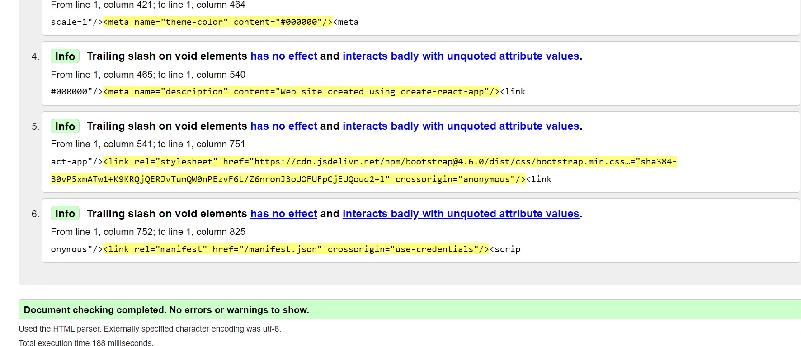

### W3C CSS Validator

The website url have been passed through the w3 validation using the url method.

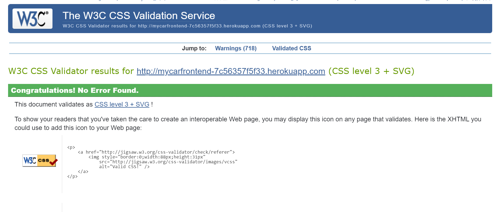

### Lighthouse Test

Chrome Developer Tools google lighthouse was used to test the application; as known the testing is done within the areas, Performance, Accessibility, Best Practices and SEO. 

The testing results are:

Home Page:

    Performance - 64

    Accessibility - 83, 
    
    Best Practises - 91, 
    
    SEO - 100

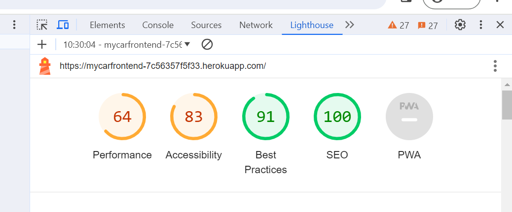

### Browser Compatibility

I have tested the application using different tools and browser. Chrome DevTools was used to test for responsiveness. The following have also been used.

* Microsoft Edge
* Chrome Browser
* Mozilla firefox
* Ipads
* Samsung s20 
* Samsung s21 ultra
* Samsung Galaxy Z Fold 5

---

# Credits

---

## Media
Images used to populate the posts are from [this](https://uk.images.search.yahoo.com/search/images;_ylt=AwrEna1aqcRljjMS2JlNBQx.;_ylu=c2VjA3NlYXJjaARzbGsDYnV0dG9u;_ylc) site.

Images for the different profiles are from [Pexels](https://www.pexels.com/).

Image the user Ayo was taken by my son to celebrate mother's day.

Default profile image from [here](https://mungfali.com/explore/Default-Photo).

Logo was made with [Logomakr](https://logomakr.com/)

## Code

To put up this project, the main inspiration was from the Code Institute's 'Moments Walkthrough project'. And with a desire to learn more I used the following videos and they really helped me in understanding some principles of react and the django rest;
 
 * [Build a full stack react app](https://youtu.be/1RHDhtbqo94?si=tL_X5vy05Hiaz_tg)

 * [Build a blog App](https://youtu.be/7kjud2ikReQ?si=VTjutKDxJ1TGztq5)

 * [Django + react Series](https://youtu.be/soxd_xdHR0o?si=bleESMryyUhBM8gJ)

 And I gained the knowledge for my share post concept from: 

 * [React Share concept](https://youtu.be\XViKPMwEZFU?si=HnMgZDrbP3HI2UZh)

Throughout the project, the following were helpful websites often used for troubleshooting:

* [Code Institute](https://codeinstitute.net): Walkthrough modules for the Moments app.

* [React Bootstrap documentation](https://react-bootstrap.netlify.app/): Documentation used for styling and to build responsive web pages.

* [Code Institute Tutor Support](https://slack.com/intl/en-gb/): For help and support.

* [React documentation](https://react.dev/): Everything you need to know about React

* [Stack Overflow](https://stackoverflow.com/): My easy go to for troubleshooting and more understanding.

* [W3Schools](https://www.w3schools.com/): I have gained so much from this in all aspect of coding.

* [FreeCodeCamp](https://www.freecodecamp.org/): I have gained so much with their series of videos and tasks availble.

---
# Acknowledgement
---

My special thank you goes to the following:

My number one cheerleader and husband Adegoke, for his encouragement and support along the way, for constantly reminding me that I can do this. I do cherish all your efforts. I know you sometimes don't understand your contribution means a lot to me; even when you don't know what it means in development, I can assure you it has always prompted me in the right direction.

My kids (my boys), for allowing mummy take time out to learn and always assuring me that I can do it.

My mentor 'Okwudiri Okoro' for his assurance when I had doubts with this section. He searched videos that used used the concept I had issues with.

The tutors at code institute especially Oisin, Gemma for taking your time out to help me debug the issue I had during the build up of the project.

